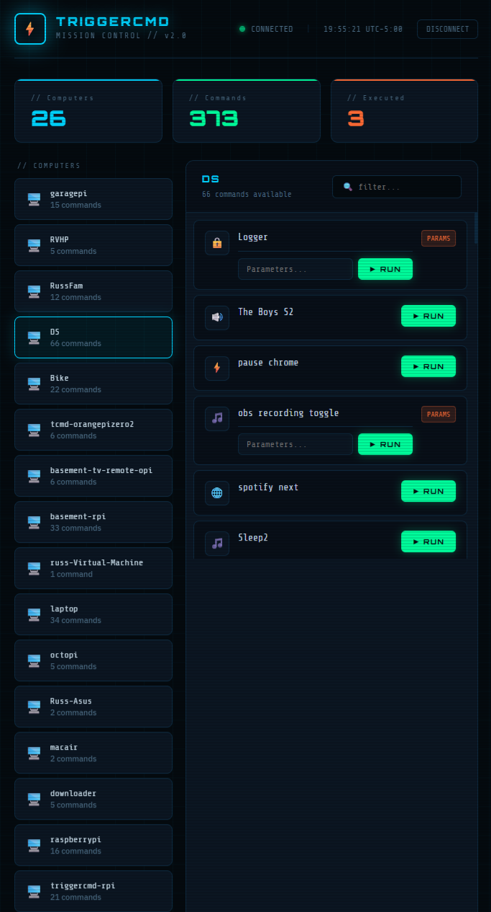

# TRIGGERcmd Mission Control



## Getting Started

### Prerequisites

- [Node.js](https://nodejs.org/) (v24 or later recommended)

### Install Dependencies

```sh
npm install
```

### Start the Dev Server

```sh
npm run dev
```

This starts a local development server with hot reload. Open the URL shown in the terminal (typically http://localhost:5173) to view the app.

## Desktop App (Electron)

### Run in Electron (dev mode)

```sh
npm run electron:dev
```

Starts Vite and Electron simultaneously. Electron loads the Vite dev server at `http://localhost:5173`.

### Build Installers

```sh
npm run electron:build
```

Runs `vite build` then `electron-builder`. Output is placed in the `dist/` folder:

| Platform | Output |
|---|---|
| Windows | `dist/TRIGGERcmd Mission Control Setup x.x.x.exe` (NSIS installer) |
| macOS | `dist/TRIGGERcmd Mission Control-x.x.x.dmg` |
| Linux | `dist/TRIGGERcmd Mission Control-x.x.x.AppImage` |

> **Note:** Each platform installer must be built on that platform (or in CI on the matching OS).

### Code Signing — Windows (YubiKey EV Certificate)

The `package.json` `build.win.signtoolOptions` block is pre-configured to sign with the **TRIGGERcmd (VanderMey Consulting LLC)** EV certificate stored on a YubiKey.

**Prerequisites:**

1. Insert the YubiKey with the EV code signing certificate.
2. Install the [YubiKey Smart Card Minidriver](https://www.yubico.com/support/download/smart-card-drivers-tools/) or the [YubiKey PIV Tool](https://www.yubico.com/support/download/yubikey-manager/) so the cert appears in the Windows Certificate Store (`certmgr.msc` → Personal → Certificates).
3. Confirm the correct certificate is visible:
   ```powershell
   Get-ChildItem Cert:\CurrentUser\My | Where-Object { $_.EnhancedKeyUsageList -match "Code Signing" } | Select-Object Subject, Thumbprint, NotAfter
   ```

**Build and sign:**

```sh
npm run electron:build
```

`signtool.exe` is called four times during the build (main executable, `elevate.exe`, uninstaller, and the setup installer). The **YubiKey will prompt for its PIN each time** — keep the YubiKey inserted and respond to each PIN dialog.

**If the thumbprint changes** (e.g. certificate renewal), update `certificateSha1` in `package.json`:

```json
"signtoolOptions": {
  "certificateSha1": "<new-thumbprint>",
  "signingHashAlgorithms": ["sha256"]
}
```

#### First-time setup on a new Windows machine

`electron-builder` downloads a `winCodeSign` toolchain that contains macOS symlinks, which Windows cannot extract without Administrator privileges or Developer Mode enabled. Pre-populate the cache once with:

```powershell
$cacheDir = "$env:LOCALAPPDATA\electron-builder\Cache\winCodeSign\winCodeSign-2.6.0"
New-Item -ItemType Directory -Force -Path $cacheDir | Out-Null
Invoke-WebRequest -Uri "https://github.com/electron-userland/electron-builder-binaries/releases/download/winCodeSign-2.6.0/winCodeSign-2.6.0.7z" -OutFile "$env:TEMP\winCodeSign-2.6.0.7z"
& ".\node_modules\7zip-bin\win\x64\7za.exe" x "$env:TEMP\winCodeSign-2.6.0.7z" "-o$cacheDir" -y -snl-
```

This only needs to be done once per machine. Subsequent builds will use the cached files.